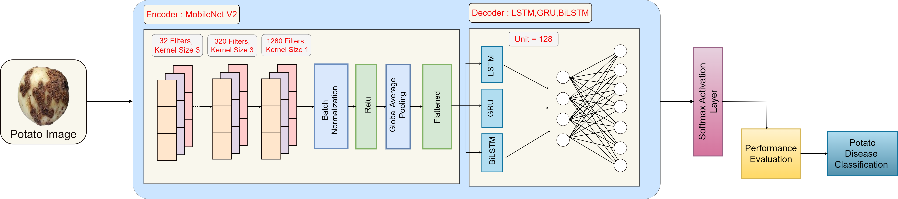

# Classification-of-Potato-Disease-A-Hybrid-Deep-Learning-Framework
## Abstract
Potatoes are among the major vegetables in agricul- 
tural regions, and it is farmed and utilized all over the world. 
Potatoes are a high-protein food with several health benefits, but 
there are numerous diseases associated with potatoes that hamper 
production. In this research, we developed a hybrid approach 
that employs image processing and combines MobileNet V2 with 
LSTM, GRU, and Bidirectional LSTM to evaluate potato disease 
classes known as Black Scurf, Common Scab, Blackleg, Dry Rot, 
Pink Rot, Healthy, and Miscellaneous. We examined the outcomes 
of each architecture after applying it independently to determine 
the optimal architecture configuration for categorizing potato 
diseases. In terms of accuracy, the results show that the hybrid 
MobileNet V2-GRU with Stochastic Gradient Descent optimizer 
strategy exceeds the other alternative. On the test dataset, we 
achieved 99% accuracy.

## Table of Contents
- [Paper](#paper-link)
- [Proposed Methodology](#experimental-methodology)
- [Dataset Availability](#dataset-availability)
- [Results](#results)
- [Contact Information](#contact-information)
- [Citation](#citation)

## Paper Link
Explore our research on "Classification of Potato Diseases" to delve into our innovative hybrid deep learning framework for accurate disease classification. To view our detailed findings and methodologies, access the full paper [here](https://ieeexplore.ieee.org/document/10099162).

## Proposed Methodology


    
## Dataset Availability

The dataset can be accessed from [here](https://github.com/Wasi34/Comprehensive-Potato-Disease-Dataset).

### Specifics of the Core Data:

| Disease Name   | Total Images | Causes of Disease |
|----------------|--------------|-------------------|
| **Common scab**| 47           | Bacteria          |
| **Blackleg**    | 40           | Bacteria          |
| **Dry rot**     | 44           | Fungus            |
| **Pink rot**    | 46           | Fungus            |
| **Black scurf** | 36           | Fungus            |


## Results
### Table 1: Potential Assessment Predictions of Deep Hybrid Learning Model to Classify the Potato Disease using Adam Optimizer
| Decoder | Accuracy | Precision | Recall | F1 Score |
|---------|----------|-----------|--------|----------|
| LSTM    | 0.9446   | 0.9456    | 0.9446 | 0.9436   |
| GRU     | 0.9714   | 0.9727    | 0.9714 | 0.9715   |
| BiLSTM  | 0.9553   | 0.9574    | 0.9553 | 0.9555   |


### Table 2: Potential Assessment Predictions of Deep Hybrid Learning Model to Classify the Potato Disease using Stochastic Gradient Descent Optimizer

| Decoder | Accuracy | Precision | Recall | F1 Score |
|---------|----------|-----------|--------|----------|
| LSTM    | 0.9928   | 0.9928    | 0.9928 | 0.9928   |
| GRU     | 0.9946   | 0.9947    | 0.9946 | 0.9946   |
| BiLSTM  | 0.9678   | 0.9678    | 0.9699 | 0.9678   |

### Table 3: Potential Assessment Predictions of Deep Hybrid Learning Model to Classify the Potato Disease using Adam Optimizer

| Decoder | Accuracy | Precision | Recall | F1 Score |
|---------|----------|-----------|--------|----------|
| LSTM    | 0.9446   | 0.9456    | 0.9446 | 0.9436   |
| GRU     | 0.9714   | 0.9727    | 0.9714 | 0.9715   |
| BiLSTM  | 0.9553   | 0.9574    | 0.9553 | 0.9555   |


## Contact Information

For any questions, collaboration opportunities, or further inquiries, please feel free to reach out:

- **Fatema Tuj Johora Faria**
  - Email: [fatema.faria142@gmail.com](mailto:fatema.faria142@gmail.com)

- **Mukaffi Bin Moin**
  - Email: [mukaffi28@gmail.com](mailto:mukaffi28@gmail.com)


    
## Citation

<!--If you find the dataset or the associated research work helpful, please consider citing our paper: -->

```bibtex
@inproceedings{faria2023classification,
  title={Classification of potato disease with digital image processing technique: a hybrid deep learning framework},
  author={Faria, Fatema Tuj Johora and Moin, Mukaffi Bin and Al Wase, Ahmed and Sani, Md Rabius and Hasib, Khan Md and Alam, Mohammad Shafiul},
  booktitle={2023 IEEE 13th Annual Computing and Communication Workshop and Conference (CCWC)},
  pages={0820--0826},
  year={2023},
  organization={IEEE}
}


